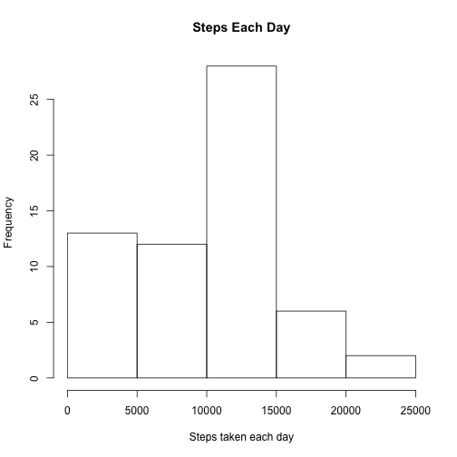
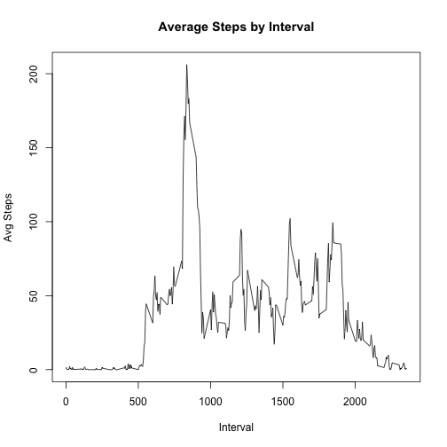
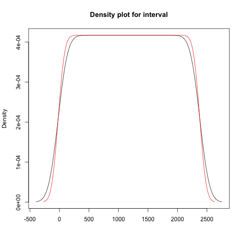
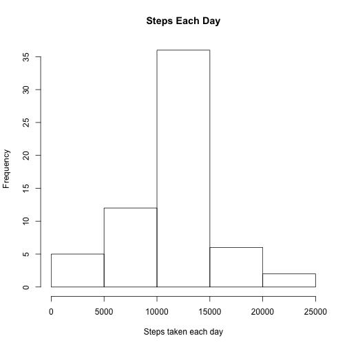
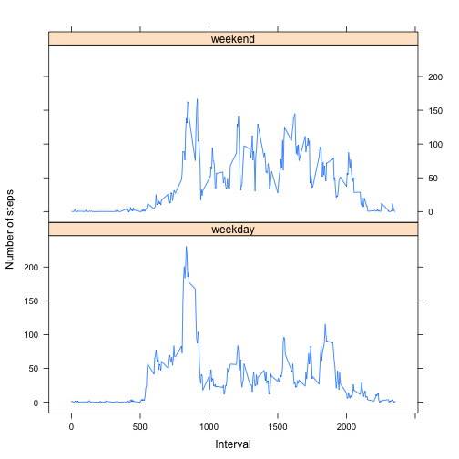

## Loading and preprocessing the data
No processing is done besides identifying missing values.

```r
data <- read.csv("activity.csv", header = TRUE, na.strings = "NA")
```
## What is mean total number of steps taken per day?
Following code calculates total number of the steps taken by date. 

```r
sumsteps <- aggregate(data$steps, by=list(data$date), FUN=sum, na.rm=TRUE)[2]
hist(sumsteps$x, xlab = "Steps taken each day", main = "Steps Each Day")
```

 
<br><br>
For total number of steps, mean is 9354.23 and Median is 10395.

```r
mean(sumsteps$x)
```

```
## [1] 9354.23
```

```r
median(sumsteps$x)
```

```
## [1] 10395
```
## What is the average daily activity pattern?
Average daily activity pattern is calculated using the average steps per interval.

```r
avgsteps <- aggregate(data$steps, by=list(data$interval), FUN=mean, na.rm=TRUE)
plot(avgsteps$Group.1, avgsteps$x, type = "l", xlab ="Interval", ylab ="Avg Steps", main ="Average Steps by Interval")
```

 
<br><br>
Five minute interval with highest avg number of steps is 830 to 835. 

```r
avgsteps_sort <- avgsteps[order(-avgsteps$x),]
data.frame(Interval = avgsteps_sort[1,1], AvgSteps= avgsteps_sort[1,2])
```

```
##   Interval AvgSteps
## 1      835 206.1698
```
## Imputing missing values
There are total 2304 cases where number of steps are missing.

```r
dim(data[!complete.cases(data),])[1]
```

```
## [1] 2304
```
For imputing missing values - average steps per interval are used. The resulting dataset is stored as data1. Average number of steps by date was considered and discarded as the missing values were dominating some particular dates, while the distribution by interval is silimar for missing and non missing values.

```r
plot(density(data[!complete.cases(data),]$interval), main ="Density plot for interval", xlab="")
lines(density(data[complete.cases(data),]$interval), col ="Red")
par(xpd=TRUE)
legend(2000, 0.00055, c("Missing","Non Missing"), bty ="n", col =c(1,2), lty =1)
```

 


```r
nadata <- data[!complete.cases(data),]
for(i in 1:dim(avgsteps)[1])
{
  for(j in 1:dim(nadata)[1])
  {
    if(nadata$interval[j] == avgsteps[i, 1]) {
      nadata$steps[j] <- ceiling(avgsteps[i, 2])
    }
  }
}
data1<- rbind(nadata, data[complete.cases(data),])
```

```r
sumsteps1 <- aggregate(data1$steps, by=list(data1$date), FUN=sum, na.rm=TRUE)[2]
hist(sumsteps1$x, xlab = "Steps taken each day", main = "Steps Each Day")
```

 
<br><br>
Mean and Median of total number of steps for missing value imputed data is higher than the dataset with missing values. Bell shape is more prominant in imputed dataset. We can see the over all shift in the distribution due to missing value replacement.

```r
mean(sumsteps1$x)
```

```
## [1] 10784.92
```

```r
median(sumsteps1$x)
```

```
## [1] 10909
```

## Are there differences in activity patterns between weekdays and weekends?
The over all shape of the plot is different for weekday vs weekends. On weekdays there is an high activity between interval 500 and 1000 while for weekends the number of steps have similar pattern for all active intervals.

```r
data1$dayweek <- ifelse(weekdays(as.Date(data1$date)) == "Saturday" | weekdays(as.Date(data1$date)) == "Sunday" , 
                       c("weekend"), c("weekday")) 
avgsteps1 <- aggregate(data1$steps, by=list(data1$interval, data1$dayweek), FUN=mean)

library(lattice)
xyplot(avgsteps1$x~avgsteps1$Group.1|avgsteps1$Group.2, 
       main="", type = "l",
       ylab="Number of steps", xlab="Interval", layout=(c(1,2))
)
```

 
